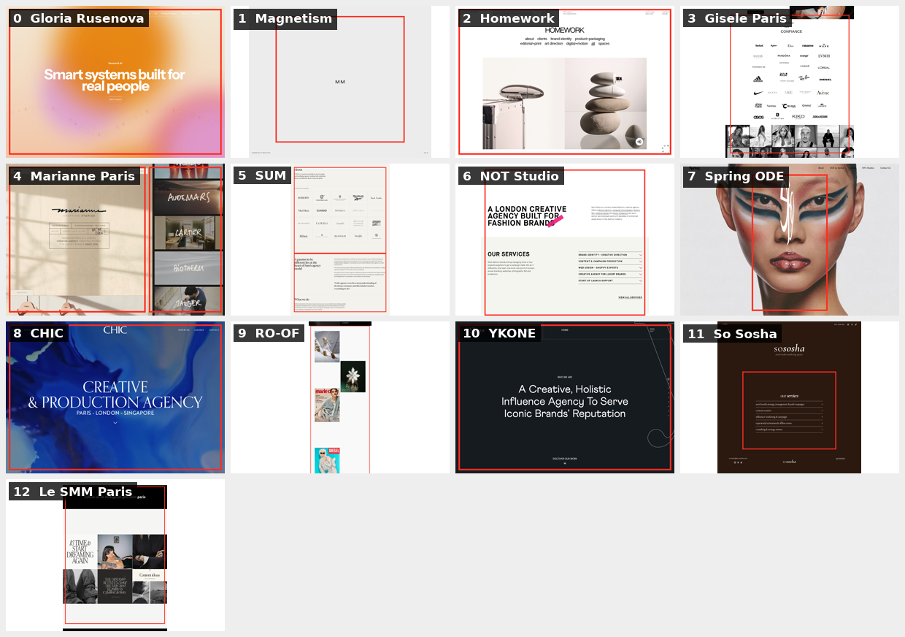

# Client inspiration map

This folder turns Alexandra's reference list into a visual decision aid for ETÉRA. The red rectangular outlines mark the exact page areas connected to the client's note; they are references for mood, rhythm, and interaction, not layouts to copy.

All source captures are desktop renders at `1440px` wide. Open the annotated full-page image for context, then use the supplementary first-viewport image where a site relies on scroll, canvas, or loading animation.

## Reference index

| # | Reference | What the client liked | Highlighted evidence |
|---:|---|---|---|
| 0 | [Gloria Rusenova](https://www.gloriarusenova.com/) | The existing benchmark: overall digital tone and the homepage's scroll-led transition from identity into work. | [Annotated full page](annotated/00-gloria-rusenova-full-annotated.png) · [Annotated opening](annotated/00-gloria-rusenova-top-annotated.png) |
| 1 | [Magnetism](https://magnetism.fr/) | The opening desktop animation and the downward transition into a visual project rhythm. | [Annotated full page](annotated/01-magnetism-full-annotated.png) · [Annotated loading moment](annotated/01-magnetism-loading-annotated.png) |
| 2 | [Homework](https://homework.dk/) | Minimalism, generous space, and a strong image-first impression. | [Annotated full page](annotated/02-homework-full-annotated.png) · [Annotated opening](annotated/02-homework-top-annotated.png) |
| 3 | [Gisèle Paris](https://www.gisele-paris.fr/) | The calm client portfolio and logo matrix. | [Annotated full page](annotated/03-gisele-paris-full-annotated.png) |
| 4 | [Marianne Paris](https://marianne.paris/) | The homepage loading composition and the project previews arranged on the right. | [Annotated full page](annotated/04-marianne-paris-full-annotated.png) · [Annotated opening](annotated/04-marianne-paris-top-annotated.png) |
| 5 | [SUM](https://sumdesign.co.uk/information) | Client proof presented together with quotes. | [Annotated full page](annotated/05-sum-information-full-annotated.png) |
| 6 | [NOT Studio](https://www.not.studio/) | Fresh accents around specific words and a magazine/editorial composition while scrolling. | [Annotated full page](annotated/06-not-studio-full-annotated.png) |
| 7 | [Spring Studios / ODE](https://www.springstudios.com/ode) | A close match for the desired tone, especially the 3D monogram treatment and footer. | [Annotated full page](annotated/07-spring-studios-ode-full-annotated.png) · [Annotated monogram opening](annotated/07-spring-studios-ode-top-annotated.png) |
| 8 | [CHIC](https://www.agencechic.com/) | An agency using its own color system as a dominant part of the experience. | [Annotated full page](annotated/08-agence-chic-full-annotated.png) · [Annotated opening](annotated/08-agence-chic-top-annotated.png) |
| 9 | [RO-OF](https://ro-of.com/) | An asymmetric portfolio arrangement for a later stage, once ETÉRA has more work to show. | [Annotated full page](annotated/09-ro-of-full-annotated.png) |
| 10 | [YKONE](https://ykone.com/) | Simple but distinctive composition, with restrained line and motion details. | [Annotated full page](annotated/10-ykone-full-annotated.png) · [Annotated opening](annotated/10-ykone-top-annotated.png) |
| 11 | [So Sosha](https://www.so-sosha.com/) | Services displayed as a compact, refined card/list system. | [Annotated full page](annotated/11-so-sosha-full-annotated.png) |
| 12 | [Le SMM Paris](https://www.lesmmparis.com/) | Associative image grids that intensify the editorial feeling. | [Annotated full page](annotated/12-lesmm-paris-full-annotated.png) |

## How to read the captures

- A red outline is an evidence marker, not a proposed ETÉRA component boundary.
- Large outlined areas mean the client referenced an overall rhythm or art direction rather than one isolated component.
- Motion-heavy sites can leave blank or delayed areas in automated full-page output. For Magnetism, Homework, Marianne, ODE, CHIC, and YKONE, the supplementary annotated opening is the clearest evidence for the named dynamic detail.
- The unmarked source files remain in [`../screenshots`](../screenshots) so the original render is always available for comparison.
- These third-party captures are design-research material only. Do not reuse their photography, logos, copy, typefaces, or proprietary branded interactions.

## ETÉRA synthesis

The references converge on six reusable principles: identity before explanation, image-led editorial rhythm, asymmetric project navigation, selective editorial interventions, brand color used at section scale, and proof/services presented without corporate weight. The implementation should translate those principles through ETÉRA's own monogram, Avenir Next typography, confirmed palette, copy, and project material.
